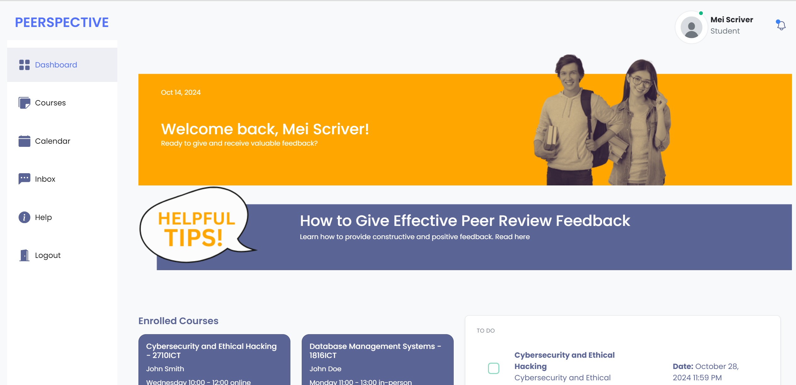

# Peer Review Web Application

## Introduction

This web application allows students to share and submit peer reviews for their courses. The application is designed to facilitate the peer review process in a simple manner, enabling interaction between students and teachers.

## Terminology

-   **Review submitted**: A review that a reviewer submits for their peer/reviewee.
-   **Review received**: A review received by the reviewee, written by their reviewer.

## Features and Implementation

### User Types

1. **Students**: Must register with their name, email, and s-number to log in.
2. **Teachers**: Seeded into the database for testing purposes.

### Authentication

-   Users must log in using their s-number and password to access functionalities.
-   The logged-in user’s name and user type (teacher or student) are displayed on every page.
-   Users can log out.

### Home Page

-   After logging in, users see a list of courses they are enrolled in or teaching.
-   Courses display the course code and name, clickable for more details.

### Course Details Page

-   Displays the teachers and assessments (peer reviews) for the course with due dates.
-   Teachers can manually enroll registered students in the course.

### Assessment Management

-   Teachers can add and update peer review assessments, including:
    -   Assessment title (up to 20 characters)
    -   Instructions (free text)
    -   Number of reviews required
    -   Maximum score (1-100)
    -   Due date and time
    -   Type (student-select or teacher-assign)

### Student Functionality

-   Students can submit peer reviews, selecting reviewees from a dropdown of course peers.
-   The submission page displays assessment details, including submitted reviews and due dates.

### Teacher Functionality

-   Teachers can mark assessments, viewing all students' submitted and received reviews.
-   A pagination system lists students, with a limit of 10 per page.

### File Upload for Course Information

-   Teachers can upload a text file to create new courses with assessments and enrolled students.
-   The system checks for duplicate course codes.

### Peer Review Encouragement

-   Students can rate reviewers to promote useful feedback.
-   A leaderboard displays the top 5 reviewers with the highest average ratings.

### Teacher-Assign Feature

-   Randomly assigns students to peer review groups, ensuring efficient management for large classes.
-   Students can only review within their assigned groups.

## Screenshots

1. **Login Page**
   

2. **Sign Up Page**
   

3. **Student Dashboard**
   

4. **Teacher Dashboard**
   

5. **Course Details - Student View**
   

6. **Course Details - Teacher View**
   

7. **Assessment View - Student**
   

8. **Assessment View - Teacher**
   

9. **Add Assessment - Teacher**
   

10. **Feedback Screen - Student**
    

11. **Feedback Screen 2 - Student**
    

12. **Import Course Data - Teacher**
    

13. **Student Help Page**
    

## Conclusion

This application provides a robust platform for students to engage in peer reviews, encouraging constructive feedback while simplifying the management process for teachers. The features implemented address the requirements outlined in the assignment specification effectively.
